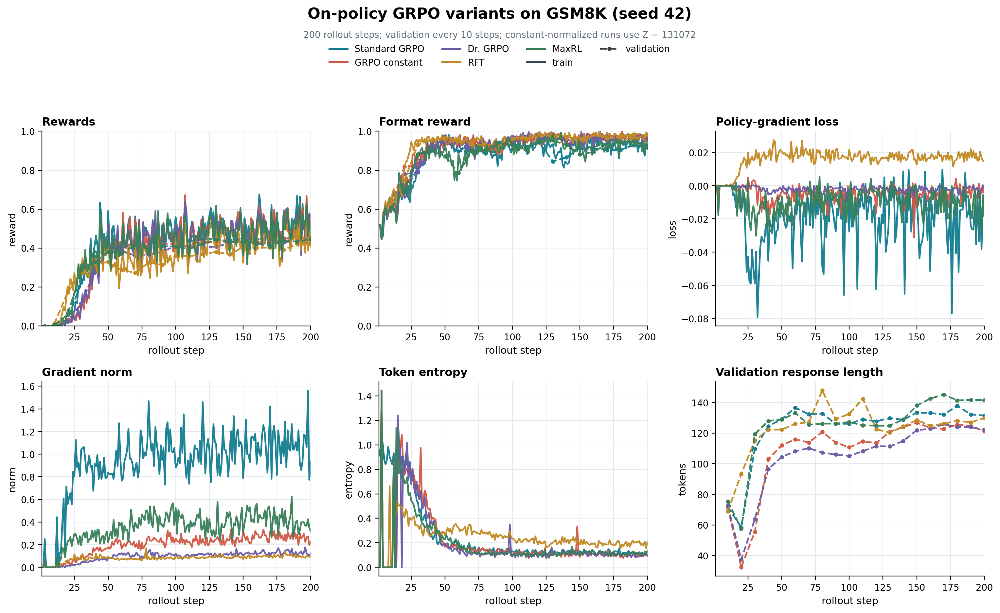

# Post-Training Language Model From Scratch

> 从可验证奖励到策略优化的语言模型 Post-Training 实现

这是一个基于 `allenai/OLMo-2-0425-1B` 和 GSM8K 的推理能力 Post-Training 实现与实验项目。

项目从一个预训练的 1B 参数语言模型开始，使用 PyTorch 逐步实现完整的 Post-Training 流程，包含 Prompt 构造、rollout 生成、可验证奖励、策略梯度目标、梯度累积、vLLM 权重同步和实验记录。

项目来源于 Stanford CS336 Assignment 5: Alignment。课程提供了初始任务设定和函数接口。本仓库将实现、实验和分析整理为一个独立的 Post-Training 项目。

## 项目概览

| 组件 | 配置 |
| --- | --- |
| 基础模型 | `allenai/OLMo-2-0425-1B` |
| 数据集 | GSM8K train 和 test split |
| Rollout 引擎 | vLLM 0.19.1 |
| 训练框架 | PyTorch 和 Hugging Face Transformers |
| 奖励函数 | 答案正确性与输出格式 |
| 策略目标 | REINFORCE-style loss、GRPO 和 GSPO |
| 实验记录 | JSONL metrics、rollout 样例和配置文件 |

## 训练流程

每个训练周期按照以下流程运行：

```text
GSM8K 问题
    |
    v
构造 Prompt
    |
    v
使用 vLLM 生成 rollout
    |
    v
计算可验证奖励和 group-normalized advantage
    |
    v
计算当前策略的 log probabilities
    |
    v
计算 policy-gradient loss
    |
    v
梯度累积和优化器更新
    |
    v
将最新权重同步回 vLLM
```

训练代码通过 response mask 将 Prompt token 排除在策略损失之外。Padding token 不参与 loss 和 entropy 统计。Microbatch 降低单次前向计算的显存需求，梯度在逻辑训练 batch 内累积。

## 核心实现与实验结果

### Prompting Baseline

Prompting 实验在 1,319 条 GSM8K test 样本上比较三种 Prompt：

- Question-only Prompting
- Zero-shot R1-style Prompting
- 使用 GSM8K 示例的 Three-shot R1-style Prompting

奖励类别直接按照 grader 的输出定义：

- Category 1：格式正确，答案正确
- Category 2：格式正确，答案错误
- Category 3：格式错误，答案错误
- Other：其他组合

| Prompt | Category 1 | Category 2 | Category 3 | Other |
| --- | ---: | ---: | ---: | ---: |
| Question-only | 1 | 134 | 1,184 | 0 |
| R1 zero-shot | 0 | 797 | 522 | 0 |
| R1 three-shot | 219 | 1,054 | 46 | 0 |

### On-policy GRPO 变体

On-policy 实验使用 200 个 rollout steps，随机种子为 42，每 10 个 rollout steps 进行一次 validation。

| 方法 | Validation reward | Format reward | Answer reward | Response length |
| --- | ---: | ---: | ---: | ---: |
| Standard GRPO | 0.4512 | 0.9170 | 0.4512 | 131.4 |
| GRPO constant | 0.4512 | 0.9609 | 0.4512 | 121.2 |
| Dr. GRPO | 0.4229 | 0.9678 | 0.4229 | 122.2 |
| RFT | 0.4219 | 0.9814 | 0.4219 | 129.8 |
| MaxRL | 0.4453 | 0.9258 | 0.4453 | 141.6 |



曲线显示，模型在训练早期快速提升输出格式合规率。Answer reward 的提升速度较慢，训练过程存在明显波动。不同方法最终达到相近的 reward 区间，同时在 response length、entropy 和 gradient norm 上呈现不同的变化。四个随机种子的 Standard GRPO 结果保存在 `experiments/grpo_standard/` 中，可以观察到明显的 run-to-run variation。

### Off-policy 实验

Off-policy 训练使用一个包含 256 条 response 的 rollout batch，并进行 32 次训练更新。每次更新使用 8 条 response。第一次参数更新前计算旧策略的 log probabilities，后续更新持续使用这组固定值。

| Variant | Reweighting | Clip range |
| --- | --- | ---: |
| `offpolicy_naive` | None | - |
| `offpolicy_noclip` | Token-level importance weighting | - |
| `offpolicy_clip` | Token-level GRPO clipping | 0.2 |
| `offpolicy_gspo` | Sequence-level geometric-mean weighting | 0.0003 |

每个实验会在 `experiments/` 下保存配置、rollout 样例、训练指标和终端日志。指标包含 reward、format reward、answer reward、loss、gradient norm、token entropy，以及 clipped 方法的 clip fraction。

## 仓库结构

```text
cs336_alignment/
  grpo.py                    Tokenization、reward、loss 和 train step
  drgrpo_grader.py           GSM8K reward function
  prompts/                   Prompt 模板
  vllm_utils.py              vLLM 生命周期和权重同步
scripts/
  prompting_baselines.py     Prompting evaluation
  train_grpo.py              On-policy 和 off-policy 训练循环
data/gsm8k/                  GSM8K 数据文件
experiments/                 Metrics、rollout 样例、图片和日志
tests/                       单元测试和数值 snapshot
```

## 快速开始

项目使用 `uv` 管理环境：

```bash
uv sync --no-install-package flash-attn
uv sync
```

运行 GRPO 测试：

```bash
uv run pytest tests/test_grpo.py
```

### 运行实验

训练脚本通过 `GRPO_VARIANT` 选择实验配置：

```bash
GRPO_VARIANT=standard GRPO_SEED=42 GRPO_STEPS=200 uv run python scripts/train_grpo.py
```

运行 off-policy variant：

```bash
GRPO_VARIANT=offpolicy_naive GRPO_SEED=42 GRPO_STEPS=200 uv run python scripts/train_grpo.py
```

默认硬件配置将策略模型放在逻辑设备 `cuda:0`，将 vLLM 放在物理 GPU 2。使用 `CUDA_VISIBLE_DEVICES` 可以指定策略模型使用的物理 GPU。

## 参考资料

- [CS336 Assignment 5: Alignment](cs336_spring2026_assignment5_alignment.pdf)
- [GSM8K](https://github.com/openai/grade-school-math)
- [OLMo 2](https://allenai.org/olmo)
- [vLLM](https://github.com/vllm-project/vllm)
