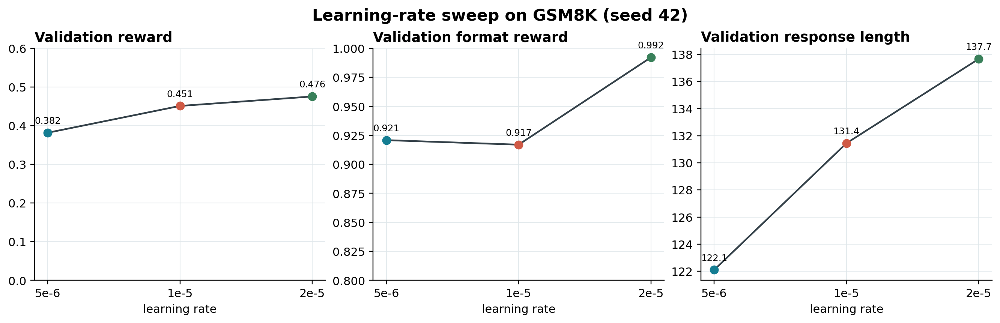
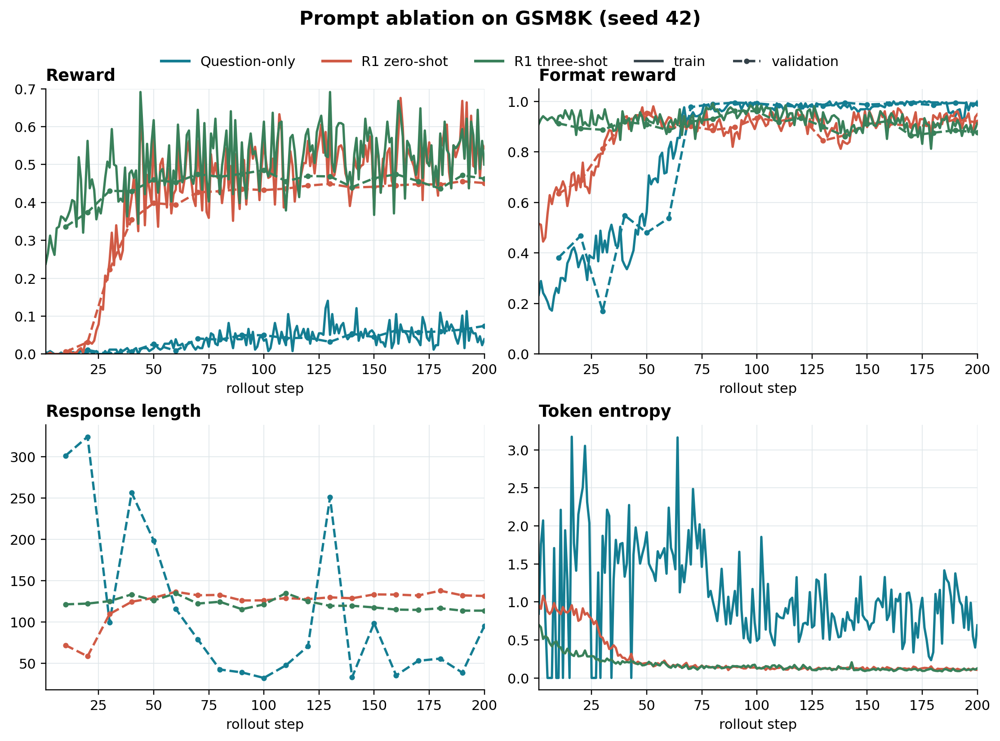
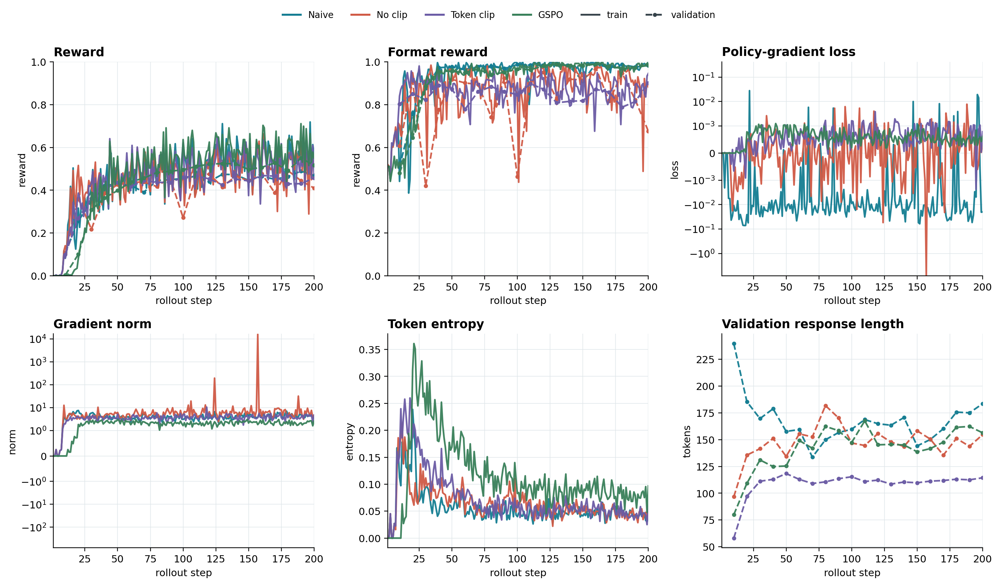
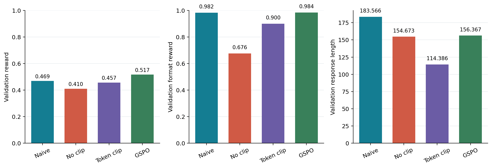

# Post-Training Language Model From Scratch

> 从可验证奖励到策略优化的语言模型 Post-Training 实现

这是一个基于 `allenai/OLMo-2-0425-1B` 和 GSM8K 的推理能力 Post-Training 实现与实验项目。

项目从一个预训练的 1B 参数语言模型开始，使用 PyTorch 逐步实现完整的 Post-Training 流程，包含 Prompt 构造、rollout 生成、可验证奖励、策略梯度目标、梯度累积、vLLM 权重同步和实验记录。

项目来源于 Stanford CS336 Assignment 5: Alignment。课程提供了初始任务设定和函数接口。本仓库将实现、实验和分析整理为一个独立的 Post-Training 项目。

## 项目概览

| 组件 | 配置 |
| --- | --- |
| 基础模型 | `allenai/OLMo-2-0425-1B` |
| 数据集 | GSM8K train 和 test split |
| Rollout 引擎 | vLLM 0.19.1 |
| 训练框架 | PyTorch 和 Hugging Face Transformers |
| 奖励函数 | 答案正确性与输出格式 |
| 策略目标 | REINFORCE-style loss、GRPO 和 GSPO |
| 实验记录 | JSONL metrics、rollout 样例和配置文件 |

## 训练流程

每个训练周期按照以下流程运行：

```text
GSM8K 问题
    |
    v
构造 Prompt
    |
    v
使用 vLLM 生成 rollout
    |
    v
计算可验证奖励和 group-normalized advantage
    |
    v
计算当前策略的 log probabilities
    |
    v
计算 policy-gradient loss
    |
    v
梯度累积和优化器更新
    |
    v
将最新权重同步回 vLLM
```

训练代码通过 response mask 将 Prompt token 排除在策略损失之外。Padding token 不参与 loss 和 entropy 统计。Microbatch 降低单次前向计算的显存需求，梯度在逻辑训练 batch 内累积。

## 核心实现

### Prompting 与 rollout

`scripts/evaluation/prompting_baselines.py` 使用 vLLM 批量生成 GSM8K response，并调用
`post_training/gsm8k_grader.py` 分别计算格式奖励和答案奖励。Prompt 模板支持 question-only、zero-shot
R1-style 和 GSM8K three-shot 三种设置。

### Reward 与策略优化

`post_training/grpo.py` 完成了以下组件：

- 分别 tokenize prompt 和 response，并构造 response mask；
- 计算 response token 的 log probabilities 和 entropy；
- 计算 rollout reward、group-normalized advantage 和不同 advantage normalizer；
- 实现 sequence/constant loss normalization 与 microbatch gradient accumulation；
- 实现 standard GRPO、GRPO constant、Dr. GRPO、RFT 和 MaxRL。

### Off-policy 更新

训练脚本固定一批 rollout 的 old log probabilities，在同一批 response 上执行多次更新，支持
token-level importance weighting、GRPO clipping 和 GSPO sequence-level geometric-mean weighting。

## 实验结果

### Prompting Baseline

Prompting 实验在 1,319 条 GSM8K test 样本上比较三种 Prompt：

- Question-only Prompting
- Zero-shot R1-style Prompting
- 使用 GSM8K 示例的 Three-shot R1-style Prompting

奖励类别直接按照 grader 的输出定义：

- Category 1：格式正确，答案正确
- Category 2：格式正确，答案错误
- Category 3：格式错误，答案错误
- Other：其他组合

| Prompt | Category 1 | Category 2 | Category 3 | Other |
| --- | ---: | ---: | ---: | ---: |
| Question-only | 1 | 134 | 1,184 | 0 |
| R1 zero-shot | 0 | 797 | 522 | 0 |
| R1 three-shot | 219 | 1,054 | 46 | 0 |

对应比例如下：

| Prompt | Category 1 | Category 2 | Category 3 |
| --- | ---: | ---: | ---: |
| Question-only | 0.08% | 10.16% | 89.76% |
| R1 zero-shot | 0.00% | 60.42% | 39.58% |
| R1 three-shot | 16.60% | 79.91% | 3.49% |

Question-only 几乎不会产生符合 grader 格式的有效答案。Zero-shot R1-style prompt 明显提高了格式遵循率，模型开始稳定输出推理和答案结构，但正确率仍为 0。Three-shot prompt 将格式合规率提高到 96.51%，正确率达到 16.60%，说明示例对输出格式和推理行为都有明显影响。

### On-policy GRPO 变体

On-policy 实验使用 200 个 rollout steps，随机种子为 42，每 10 个 rollout steps 进行一次 validation。

| 方法 | Validation reward | Format reward | Answer reward | Response length |
| --- | ---: | ---: | ---: | ---: |
| Standard GRPO | 0.4512 | 0.9170 | 0.4512 | 131.4 |
| GRPO constant | 0.4512 | 0.9609 | 0.4512 | 121.2 |
| Dr. GRPO | 0.4229 | 0.9678 | 0.4229 | 122.2 |
| RFT | 0.4219 | 0.9814 | 0.4219 | 129.8 |
| MaxRL | 0.4453 | 0.9258 | 0.4453 | 141.6 |

Standard GRPO 额外运行了四个随机种子，用于观察 RL 训练的 run-to-run variation：

| Seed | Validation reward | Format reward | Response length |
| ---: | ---: | ---: | ---: |
| 42 | 0.4512 | 0.9170 | 131.4 |
| 666 | 0.4775 | 0.9385 | 184.3 |
| 114514 | 0.0742 | 0.9990 | 14.2 |
| 721 | 0.4512 | 0.9141 | 144.3 |
| Mean +/- sample std | 0.3635 +/- 0.1933 | 0.9421 +/- 0.0395 | 118.6 +/- 73.1 |


模型在训练早期快速提升输出格式合规率，答案奖励随后逐步提升。Standard GRPO 四个 seed 的平均 validation reward 为 0.3635，高于作业要求的 0.25。Seed 114514 的 reward 只有 0.0742，但格式 reward 达到 0.9990，同时 response length 降到 14.2，说明这次运行更偏向短格式输出。较大的 reward 和 response length 方差表明单个 seed 的曲线只能用于观察训练过程，方法之间的严格比较需要更多重复实验。

在 seed 42 的变体对比中，GRPO constant 与 Standard GRPO 达到相同的 validation reward，同时格式 reward 更高、response 更短。Dr. GRPO 和 RFT 的最终 reward 略低，MaxRL 与 Standard GRPO 接近。constant normalization、advantage normalization 和 RFT 的差异会同时影响更新尺度与输出长度，当前结果用于展示趋势。

### Learning-rate sweep

在 zero-shot `r1_zero` Prompt 下比较 `5e-6`、`1e-5` 和 `2e-5`。`1e-5` 直接使用 Standard GRPO 的 seed42 结果。

| Learning rate | Validation reward | Format reward | Response length |
| ---: | ---: | ---: | ---: |
| `5e-6` | 0.3818 | 0.9209 | 122.1 |
| `1e-5` | 0.4512 | 0.9170 | 131.4 |
| `2e-5` | 0.4756 | 0.9922 | 137.7 |



在当前 seed 下，学习率从 `5e-6` 提高到 `2e-5` 后 validation reward 逐步上升。较大的学习率同时带来更长的 response 和更高的格式 reward。这个 sweep 只有一个 seed，结果用于选择后续实验配置和观察趋势。

### Prompt ablation

使用 Standard GRPO 和相同的训练超参数，比较 question-only、zero-shot `r1_zero` 和 three-shot `r1_zero` Prompt。Question-only 使用对应的 boxed-answer grader，R1 Prompt 使用 `<think>` 和 `<answer>` grader。

| Prompt | Validation reward | Format reward | Response length |
| --- | ---: | ---: | ---: |
| Question-only | 0.0742 | 0.9912 | 95.1 |
| R1 zero-shot | 0.4512 | 0.9170 | 131.4 |
| R1 three-shot | 0.4629 | 0.8770 | 113.7 |



Question-only 训练后能够稳定输出符合 boxed-answer 格式的回答，validation answer reward 仍然较低。R1 zero-shot 和 three-shot 都显著提高答案 reward。Three-shot 在当前 seed 下取得最高 validation reward，同时 response 更短；它的格式 reward 低于 zero-shot，说明 few-shot 示例带来的收益主要体现在答案行为和探索结果上。Prompt ablation 只有一个 seed，结论用于观察当前配置下的差异。

### Off-policy 实验

Off-policy 训练使用一个包含 256 条 response 的 rollout batch，并进行 32 次训练更新。每次更新使用 8 条 response。第一次参数更新前计算旧策略的 log probabilities，后续更新持续使用这组固定值。

| Variant | Reweighting | Clip range |
| --- | --- | ---: |
| `offpolicy_naive` | None | - |
| `offpolicy_noclip` | Token-level importance weighting | - |
| `offpolicy_clip` | Token-level GRPO clipping | 0.2 |
| `offpolicy_gspo` | Sequence-level geometric-mean weighting | 0.0003 |

每个实验会在 `experiments/` 下保存配置、rollout 样例、训练指标和终端日志。指标包含 reward、format reward、answer reward、loss、gradient norm、token entropy，以及 clipped 方法的 clip fraction。

四个 off-policy 变体均运行 200 steps，使用 seed 42：

| Variant | Validation reward | Format reward | Response length | Clip fraction |
| --- | ---: | ---: | ---: | ---: |
| `offpolicy_naive` | 0.4688 | 0.9824 | 183.6 | - |
| `offpolicy_noclip` | 0.4102 | 0.6758 | 154.7 | - |
| `offpolicy_clip` | 0.4570 | 0.9004 | 114.4 | 0.0046 |
| `offpolicy_gspo` | 0.5166 | 0.9844 | 156.4 | 0.1328 |





在当前 seed 下，GSPO 达到最高 validation reward 和较高的格式 reward。Token-level clip 的 clip fraction 较低，但 response length 明显缩短。GSPO 的 clip fraction 为 0.1328，训练 gradient norm 低于 token-level clip 和 noclip，曲线中的极端波动也较少。Noclip 的 validation reward 和格式 reward 最低，说明固定 rollout 上进行多次更新时，只进行 token-level reweighting、缺少 clipping 会带来更明显的稳定性问题。off-policy 结果目前只有一个 seed，结论用于比较当前配置下的行为，不能直接推广到所有运行。

## 当前实验范围

- Standard GRPO 已完成四个 seed；on-policy 变体和 off-policy 变体目前使用 seed 42 做对比；
- Learning-rate sweep 和 prompt ablation 已完成 seed 42 实验；
- 结果重点覆盖 GSM8K reward、输出格式、response length、entropy、gradient norm 和 clipping 行为；
- 其余变体的多 seed 扩展、自定义 policy-gradient estimator 和 supplement 中的 SFT、DPO、safety 实验保留为后续扩展。

## 仓库结构

```text
post_training/
  grpo.py                    Tokenization、reward、loss 和 train step
  gsm8k_grader.py            GSM8K reward function
  prompts/gsm8k/             GSM8K Prompt 模板
  prompts/safety/            Safety/RLHF Prompt 模板
  vllm_utils.py              vLLM 生命周期和权重同步
scripts/
  training/train_grpo.py     On-policy 和 off-policy 训练循环
  evaluation/                Prompting 和 safety evaluation
  plotting/                  训练曲线绘图脚本
data/
  gsm8k/                      GSM8K 数据文件
  safety/                     可选 safety/RLHF 数据
experiments/
  on_policy/                  On-policy 训练结果
  off_policy/                 Off-policy 训练结果和失败运行归档
  learning_rate_sweep/        Learning-rate sweep 结果
  prompt_ablation/             Prompt ablation 结果
  figures/                    训练曲线和最终指标图
  logs/                       训练日志
docs/                         课程材料
tests/                       单元测试和数值 snapshot
```

主要图像文件：

- `experiments/figures/on_policy/variants_seed42.png`：on-policy GRPO 变体曲线；
- `experiments/figures/learning_rate_sweep_seed42.png`：learning-rate sweep 结果；
- `experiments/figures/prompt_ablation_seed42.png`：Prompt ablation 曲线；
- `experiments/figures/off_policy/variants_seed42.png`：off-policy 训练曲线；
- `experiments/figures/off_policy/final_seed42.png`：off-policy 最终 validation 指标。

## 快速开始

项目使用 `uv` 管理环境：

```bash
uv sync --extra gpu --extra plots
```

只运行 CPU 单元测试时可以使用 `uv sync`。

运行 GRPO 测试：

```bash
uv run --extra gpu --extra plots pytest tests/test_grpo.py
```

### 运行实验

训练脚本通过 `GRPO_VARIANT` 选择实验配置：

```bash
GRPO_VARIANT=standard GRPO_SEED=42 GRPO_STEPS=200 uv run --extra gpu --extra plots python scripts/training/train_grpo.py
```

运行 off-policy variant：

```bash
GRPO_VARIANT=offpolicy_naive GRPO_SEED=42 GRPO_STEPS=200 uv run --extra gpu --extra plots python scripts/training/train_grpo.py
```

选择 Prompt 和学习率：

```bash
GRPO_PROMPT=three_shot GRPO_LR=1e-5 GRPO_SEED=42 GRPO_STEPS=200 uv run --extra gpu --extra plots python scripts/training/train_grpo.py
```

重新生成训练曲线：

```bash
python3 scripts/plotting/plot_grpo_variants.py
python3 scripts/plotting/plot_offpolicy_variants.py
python3 scripts/plotting/plot_learning_rate.py
python3 scripts/plotting/plot_prompt_ablation.py
```

默认硬件配置将策略模型放在逻辑设备 `cuda:0`，将 vLLM 放在物理 GPU 2。使用 `CUDA_VISIBLE_DEVICES` 可以指定策略模型使用的物理 GPU。

## 参考资料

- [CS336 Assignment 5: Alignment](docs/assignment5_alignment.pdf)
- [Assignment 5 Supplement: Safety and RLHF](docs/assignment5_supplement_safety_rlhf.pdf)
- [GSM8K](https://github.com/openai/grade-school-math)
- [OLMo 2](https://allenai.org/olmo)
- [vLLM](https://github.com/vllm-project/vllm)
